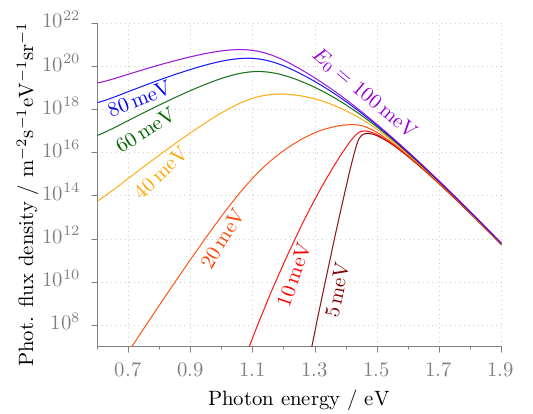

latex-gnuplot
=============

`latex-gnuplot` takes a gnuplot script which outputs to a LaTeX terminal
(`epslatex`, `pdflatex`, `cairolatex`, ...), runs *gnuplot*, embeds the
resulting `.tex` file containing the title, axis labels, etc., into a predefined
LaTeX template, and finally runs either `latex` + `dvips` or `pdflatex` to
obtain an output file.

Typical usage scenarios include submissions to journals (e.g. APS journals)
which require figures to be submitted in a self-contained format, i.e. as a
standalone file (`eps`, `pdf`) including all axis labels, keys, and titles.
`latex-gnuplot` allows you to comply with this constraint whilst still
benefitting from LaTeX typesetting for mathematical formulae. Using an
appropriate preamble file (see below), the type in the figure can be made to
look exactly as in the main LaTeX document, as though it was `\input` directly.

Before either *gnuplot* or LaTeX are invoked, the *input-gnuplot-file* and any
optional *data-file*s are copied in a temporary directory to not pollute the
working dir with auxiliary files. The final *eps* or *pdf* is copied back to the
working directory. The temporary directory is subsequently deleted; specifying
the option `--no-cleanup` will forego this, allowing to inspect any intermediate
products.

Installation
------------

To install the `latex-gnuplot` script, simply clone the repository and run the
install shell script:

    $ git clone https://github.com/jgreitemann/latex-gnuplot.git
    $ sudo ./latex-gnuplot/install.sh

The default install location is `/usr/local/`. To deviate from that, specify the
`--prefix` option, e.g. for a user-local installation:

    $ ./latex-gnuplot/install.sh --prefix $HOME/.local

By default, the accompanying man page is generated using *Pandoc* and installed
in the appropriate place (`$prefix/share/man/man1/`). To skip this, specify
`--skip-man`.

To uninstall, rerun the install script with the `-u` option.

Example
-------

The example gnuplot script [`example/photo_luminescense.gp`][1] plots a bunch of
photo-luminescense data in different colors and displays a matching label next
to each line. It also makes use of LaTeX math in axis labels. This example is
courtesy of [Hagen Wierstorf of gnuplotting.org][2] with slight modifications.

To achieve the colored labels, we utilize the `\textcolor{colorname}{text}`
command provided by the `xcolor` package. To that end, we add a file
`preamble.tex` to use that package and define the colors:

```tex
\usepackage{xcolor}
\definecolor{axes}{HTML}{808080}
\definecolor{line1}{HTML}{800000}
% ...
```

Then, in order to create the plot [`photo_luminescense.pdf`][3], shown below, we
run

    $ latex-gnuplot --pdf -P preamble.tex photo_luminescense.gp *.dat

Note that we specify PDF output, enter the preamble, and list the gnuplot script
and **all the data files** (expanded by the shell from a *glob pattern*).


<object data="doc/photo_luminescense.pdf" type="application/pdf" width="533" height="414">
  
</object>

If we deemed the font size too large, we could also *inject* a TeX command to
change it without touching any of the input files by adding the flag
`--inject '\\small'`. Note that backslashs need to be escaped.

A full list of options is documented in the [man page][4].

Templates
---------

The template files are looked up from a hierarchy of directories in the
following order:

* `$HOME/.latex-gnuplot/`
* `/usr/local/share/latex-gnuplot/`

For example, the default template is named `article`; specifying this
(`--template article`) will invoke the file `article.tex` which is installed to
the install prefix path. Template are supposed to use LaTeX packages or other
facilities to the effect of the `preview` package which allows to extract the
figure cropped to its dimensions.

A number of substitutions are performed on the template. At the very least,
templates should include a line

    \input{THEFILENAME}

where `THEFILENAME` is a token that is replaced by the name of the LaTeX
terminal's output file.

Templates can be further customized by replacing the token `THEPREAMBLE` with
the contents of a separate `.tex` file via the `--preamble` flag. Lastly, LaTeX
commands can be injected directly into the LaTeX source using the `--inject`
flag and will replace the token `THEINJECTION`.

License
-------

Copyright (C) 2018  Jonas Greitemann

This program is free software: you can redistribute it and/or modify it under
the terms of the GNU General Public License as published by the Free Software
Foundation, either version 3 of the License, or (at your option) any later
version.

This program is distributed in the hope that it will be useful, but WITHOUT ANY
WARRANTY; without even the implied warranty of MERCHANTABILITY or FITNESS FOR A
PARTICULAR PURPOSE. See the GNU General Public License for more details.

You should have received a copy of the GNU General Public License along with
this program. If not, see <http://www.gnu.org/licenses/>.

[1]: example/photo_luminescense.gp
[2]: http://www.gnuplotting.org/label-size-in-epslatex-terminal/
[3]: doc/photo_luminescense.pdf
[4]: doc/man-page.md
